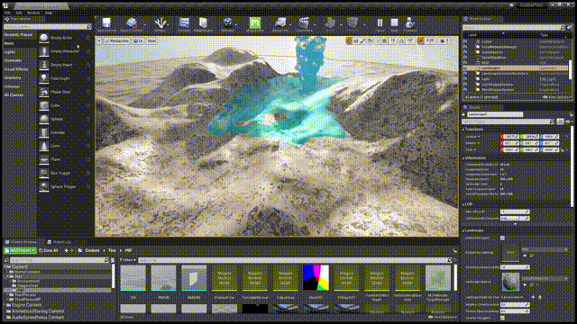
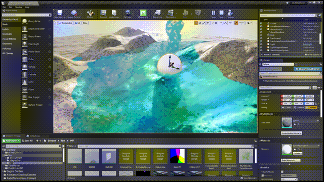

# UE4NiagaraFluid
    A Real-Time Fluid Simulation Using UE4 Niagara to do Fluid Simulation(Position based Fluid Method) and Rendering(Screen Space Fluid Rendering And SingleLayerWater in UE4.26)

I will publish the tutorial later ~~

Efficiency : RTX3070 130-150 FPS  RTX2060 60-80 FPS

