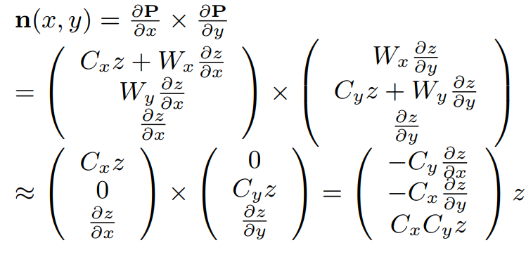

# UE4NiagaraFluid
    A Real-Time Fluid Simulation Using UE4 Niagara to do 
    Fluid Simulation(Position based Fluid Method) and
    Rendering(Screen Space Fluid Rendering and SingleLayerWater in UE4.26)

I have already published the tutorial ! ~~~  
If you think this tutorial is useful,  
Just STAR it !

Efficiency : 20000 Particles RenderTargetSize 960 * 540  
RTX3070 130-150 FPS  RTX2060 60-80 FPS

# Tutorial
+ Fluid Simulation  
You can use *SPH* , *PCISPH* , *PBF* or other Lagrangian method to simulate fluid particles.  
Here I use [PBF](https://mmacklin.com/pbf_sig_preprint.pdf) method.  
It's a simple and stable way to simulate fluid.  
For better fluid simulation effects, you can add [surface tension and adhesion](https://cg.informatik.uni-freiburg.de/publications/siggraphasia2013/2013_SIGGRAPHASIA_surface_tension_adhesion.pdf).
And you can use NeighborGrid3D in Niagara to do NeighborSearch, the example is in ContentExample Project in UE4.
+ Rendering
   + Get Depth RT - Rasterizing   
   Two ways - Pixel Parallel / Particle Parallel  
      + Pixel Parallel  
      Iterate each pixel and, in each iteration, find the particles around this pixel (you need to set a search radius here) and calculate the minimum view depth to set it into this pixel(Grid2D or RenderTarget).  
      I don't recommend to use this way because when you move the camera closer to the fluid, you will find artifacts unless you set a high search radius(It's not efficient). 
      + Particle Parallel  
      It's a simple way in Screen Space Fluid Rendering method when you can use shader to render particles and get depth by render pipeline. However, in UE4 Niagara, you need to rasterize particles yourself.  
      You can first calculate which pixels the particle contains and then compare and write depth into pixels. Here you need to use atomic operations to make sure the result is correct.(May use NeighborGrid3D instead, but it will use more video memory)  
      I use this method because it is more efficient, and it's correct when the camera is close to the fluid.  
      And when you increase the number of particles, its efficiency is still very high, because this method parallelizes the particles.  
   + Filter  
   Gaussian blur(efficient but cause blurring over silhouette edges) or variants such as Bilateral Gaussian filters(single pixel can't be seperated, so expensive)
   + Get Normal RT  
   Reference [Screen Space Fluid Rendering with Curvature Flow](https://dl.acm.org/doi/pdf/10.1145/1507149.1507164).
   
   + (Optional) Thickness RT
   + Shading Model  
   Restore particle position based on depth and then use SingleLayerWater Shader in UE4.26 to render fluid.(Create a plane to set World Offset for each vertex according to the depth RT)  
   Or you can calculate the Projected Coordinate Depth and use sprite or PostProcess to render fluid.